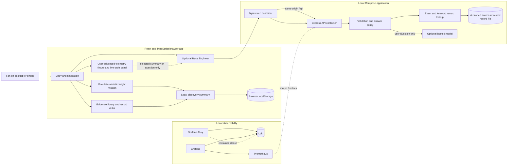
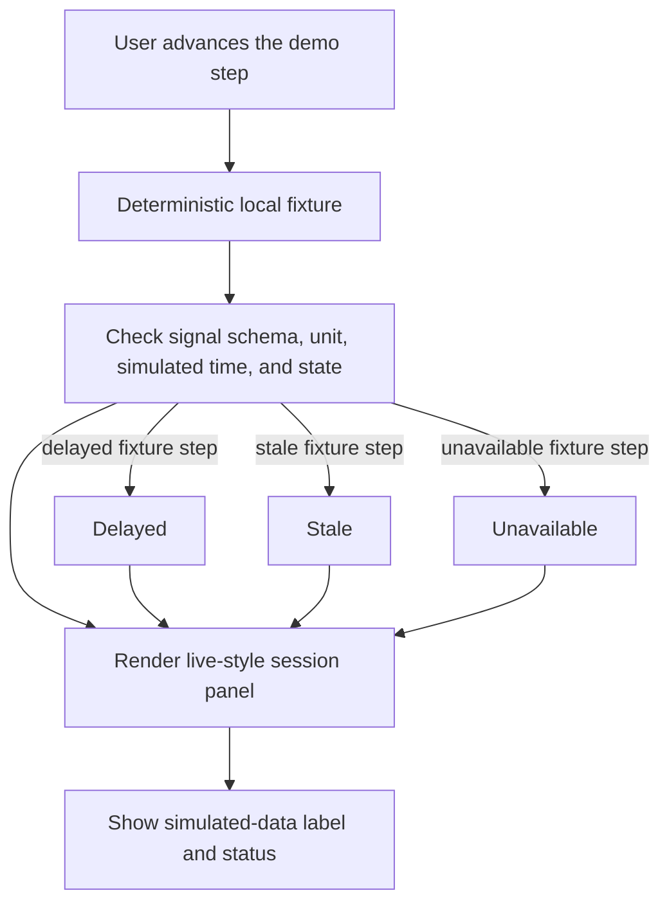
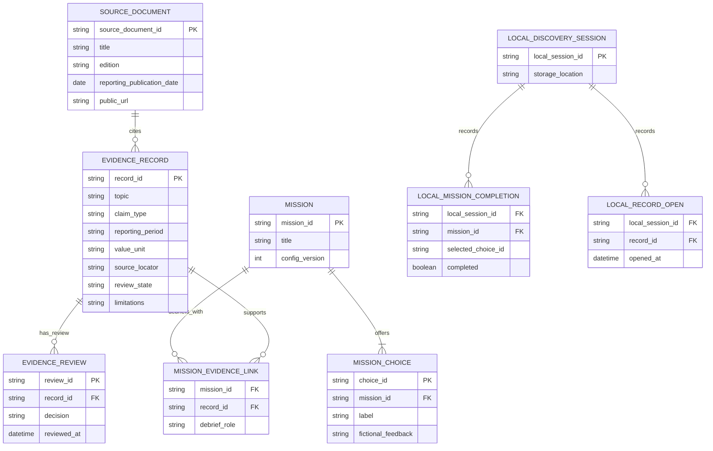
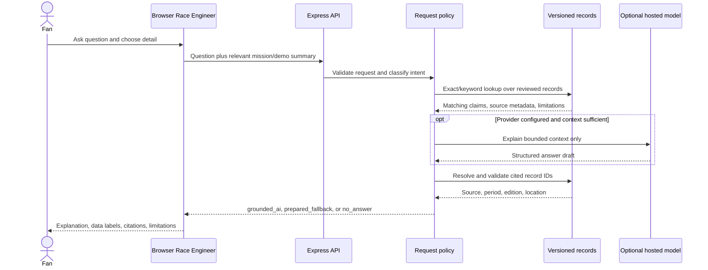
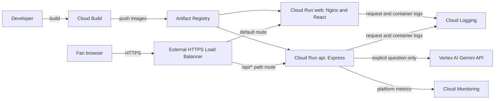
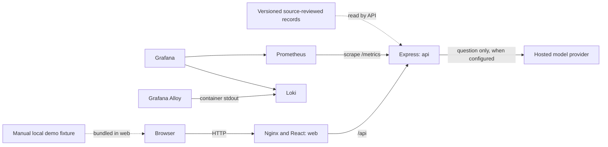

# Make A Mark Impact Drive

## System Architecture and Component Design

**Document status:** R1 target design, not an implementation report. The current prototype status is stated separately in each section. Product and audience requirements remain in the [inclusive R1 concept](Make-a-Mark-R1-inclusive-AI-concept.md).

## Contents

1. System architecture
2. Component and container plan
3. R1 development plan and acceptance criteria

---

## 1. System architecture

**Status:** Target architecture for hackathon R1. The current prototype does not yet include the R1 telemetry panel, source-reviewed evidence records, or live model integration. It currently uses a prepared Race Engineer response and illustrative records.

## Purpose and scope

R1 is a fan-facing experience in which a user can explore one fictional freight mission, inspect a limited set of source-checked AMF1 ESG records, and optionally ask a Race Engineer to explain the selected evidence and a simulated session state. The prototype uses a deterministic, manually advanced telemetry fixture. It does not connect to AMF1 systems and makes no claim that demo values are real or measured impacts.

The [inclusive R1 concept](Make-a-Mark-R1-inclusive-AI-concept.md) remains the product requirements source for audience, desirability, business opportunity, AMF1 placement, and evaluation framing. This document defines the software and data boundaries.

In scope: the React/Vite browser experience, small Express API, file-backed source-reviewed record subset, provider-neutral model adapter, deterministic demo fixture, local Compose stack, and local observability. Out of scope: accounts, user profiles, external telemetry access, continuous AI narration, vector search, database-backed content management, automated source approval, post-R1 production work, and claims that gameplay changes real-world impact.

## Architecture principles

1. Keep mission choices and results deterministic and fictional.
2. Keep four information categories separate: **Simulated live view**, **Reported impact**, **Illustrative impact placeholder**, and **Mission scenario**.
3. Use the telemetry fixture to demonstrate the interface and feed states; it never calculates impact.
4. Ground factual explanations in source-checked records and resolve citations from the record file.
5. Call a hosted model only after a user submits a question. Never send every fixture update to AI.
6. Leave browsing and the mission usable without model credentials or network access.
7. Support direct entry to the mission or evidence library without sign-in or age-based profiling.
8. Keep the R1 evidence subset small and versioned. Avoid infrastructure that the prototype does not need.

## System architecture

The telemetry fixture and its values run in the browser. The browser sends a bounded summary of the selected fixture step only when the user asks a related question. Nginx serves the built interface and proxies `/api` requests to Express. The API owns validation, record lookup, optional model calls, citation checks, and fallback selection. The hosted model is external to Compose and has no direct browser access.

## User experience and frontend boundaries

| Surface | R1 responsibility | Data boundary |
|---|---|---|
| Entry and navigation | Let users open the freight mission or evidence library directly; explain the product in plain language | No account or profile |
| Freight mission | Offer one route decision with deterministic fictional feedback, completion, and retry | Mission configuration and progress stay local; the result is not an impact measure |
| Live-style session view | Show a manually advanced scripted telemetry fixture, signal definition, unit, simulated time, and feed state | Fixture values are local demo data and do not represent an AMF1 feed |
| Evidence library | Browse the available Environment, Belong, and Community subset and inspect source details | Public source records are versioned; the library must not imply complete corpus coverage |
| Race Engineer | Offer a concise answer first or user-selected detail; show report citations, demo labels, and limitations | Calls `/api/engineer` only after an explicit question |
| Discovery summary | Show local mission completion and records opened | `localStorage`; not learning measurement or real-world impact |
| Trust and method | Explain source status, simulated values, periods, and limits | Static product copy |

Use semantic DOM controls, visible focus, keyboard and touch input, reduced motion, and an untimed non-driving path. Age is not an input to interface selection. Users can skip the game and open evidence directly.

## Information categories and trust rules

| Category | Meaning | Required treatment |
|---|---|---|
| **Simulated live view** | Scripted fixture values that advance only when the user advances the demo | Show signal, unit, simulated timestamp, and updating/delayed/stale/unavailable state. Label the view as simulated. |
| **Reported impact** | A claim in a published AMF1 ESG source | Show claim wording, source document/link, edition or date, reporting period, source location when available, and limitations. Do not imply AMF1 endorsement of this prototype. |
| **Illustrative impact placeholder** | Fictional sample value demonstrating a possible future metric display | Show the exact label: “Illustrative demo data — not live AMF1 data or a measured impact result.” Keep it adjacent to every placeholder. |
| **Mission scenario** | Fictional freight choice and deterministic game outcome | Label as fictional scenario. Never derive score or outcome from telemetry or evidence. |

A record can be source-checked for the prototype without being described as formally approved by AMF1. Only records that pass the project’s documented source review enter factual lookup. Unreviewed or rejected records are excluded. Source dates and reporting periods remain distinct.

## Telemetry fixture and state flow

The demo is user-advanced, not timer-driven. The fixture contains a finite, deterministic sequence and explicit updating, delayed, stale, and unavailable examples so a presenter can reproduce each state. Timestamps advance in demo time and are explicitly labeled simulated. No feed connection, credentials, polling, or background AI work is part of R1. A malformed or absent fixture value produces an unavailable state rather than an inferred value.

## Evidence records and retrieval

The small R1 record set is manually curated from public AMF1 sources and stored as versioned structured files. It contains only the available records that have passed source review. The record shape includes a stable ID, pillar/topic, claim type, exact claim or summary, value and unit when applicable, reporting period, source title and edition/date, URL and location, review state, and limitations. Keep source documents and records separate from illustrative placeholders.

R1 uses deterministic exact and keyword matching over this small set, optionally with topic, period, source, and claim-type filters. It does not use chunk embeddings, vector search, a graph database, OCR automation, or an always-running ingestion service. If matching records do not support the question, return a limitation or no-answer response instead of relying on general model knowledge.

The diagram is a logical model, not a requirement to deploy a database. `LOCAL_*` discovery events remain in browser storage. Demo snapshots are ephemeral request context and are not stored as evidence or persistent telemetry.

## Race Engineer request and retrieval flow

1. The user submits a question and chooses concise or detailed explanation. The UI may include the current fictional mission choice and the selected demo-state summary when relevant.
2. Express validates request shape and question length, then separates mission-rule questions from evidence questions.
3. For evidence questions, the API searches only source-reviewed records and builds a bounded context package. For telemetry questions, it uses only the supplied demo summary and signal definition.
4. If a hosted provider is configured, the server requests a constrained explanation from the selected context. The model cannot modify fixture values, mission rules, source records, or review state.
5. The API validates the response, accepts only IDs in the retrieved context, and resolves citation metadata from the record file.
6. If no provider is configured, it is unavailable, or evidence is insufficient, return the prepared fallback or `no_answer` mode with an explicit limitation.

### API boundary

| Endpoint | Current behavior | R1 target |
|---|---|---|
| `GET /api/health` | Reports prototype and illustrative-evidence mode | Report API availability and whether the optional provider is configured; do not expose secrets |
| `POST /api/engineer` | Validates a 1–500 character question and returns prepared fallback | Accept the question, concise/detailed choice, optional mission context, and a bounded demo snapshot when relevant; return answer mode, explanation, limitations, and API-resolved citations |

R1 response modes are `grounded_ai`, `prepared_fallback`, and `no_answer`. Use concise as the default. Every factual citation is resolved from a matching source-reviewed record, never generated freely by the model. The API does not persist request text, prompts, demo snapshots, or player history.

## Deployment, privacy, and resilience

### Local prototype profile

The local Compose baseline contains `web` (Nginx and the React build), `api` (Express), `prometheus`, `loki`, `alloy`, and `grafana`. Grafana queries Prometheus and Loki; Alloy forwards container stdout to Loki. Keep only the web app port reachable to the user. Bind Grafana to loopback and keep API, Loki, Prometheus, and Alloy interfaces private. This profile is the default build target and requires no cloud project. Do not add Postgres, pgvector, Redis, an ingestion container, or a model-serving container for R1.

### Optional Google Cloud demo-hosting profile

When the team needs a shareable hosted demo, use one Google Cloud project with billing enabled. In the Console, enable Cloud Build, Artifact Registry, Cloud Run, and Compute Engine/Load Balancing APIs; enable Vertex AI only if that model provider is selected, and Secret Manager only if an external static API key is used. The Google Cloud Console is the administrative interface; it is not a runtime service. The `gcloud` CLI or Cloud Build starts deployment work.

Build the same `web` and `api` containers with Cloud Build and publish them to Artifact Registry. Run Nginx/React as one Cloud Run service and Express as a second. Put an external HTTPS Application Load Balancer in front, with serverless network endpoint groups and a URL map routing `/api/*` to the API and other paths to the web service. This preserves same-origin browser requests. Configure Cloud Run ingress as `internal-and-cloud-load-balancing`; allow anonymous prototype traffic through the load balancer while blocking direct default service URLs. The HTTPS load-balancer profile requires a controlled domain and TLS certificate; use Cloud DNS for records only if DNS is not managed elsewhere.

The provider-neutral adapter can use Vertex AI Gemini API as the first hosted model option. Enable the Vertex AI API and grant the API service identity the least permissions it needs, such as Vertex AI User. Use the Google Cloud service identity rather than a downloaded service-account key. Secret Manager is needed only when choosing an external provider that requires a static API key. The API calls the provider only after an explicit user question.

Cloud Run request/container logs go to Cloud Logging. Use Cloud Monitoring for platform metrics and alerts and Error Reporting for application exceptions. Keep the local Grafana/Loki/Prometheus/Alloy stack for Compose development; it is not a required Cloud Run deployment. Cloud Armor rate limiting is an optional public-demo safeguard. No database, vector index, Redis, ingestion job, or model container is introduced by this hosting profile.

The optional model provider is called only by Express. Do not log raw questions, model prompts, source passages, credentials, or demo signal values. Logs may record route, status, duration, response mode, and dependency error class with low-cardinality labels. Avoid user-controlled text and request IDs as metric labels.

If the API or model is unavailable, the game, fixture walkthrough, and evidence library remain usable. Clear local discovery state in the browser separately from Docker volumes. Resetting Compose storage must never remove versioned source records. Cloud resources and logs are reset or retained through their own project policies; no player account or database is added.

## Implementation status

The existing prototype includes React/Vite, an Express API, a deterministic fictional mission, illustrative TypeScript records, browser-local discovery, reduced-motion support, and a prepared Race Engineer fallback. It does not include the R1 telemetry fixture, selected source-checked AMF1 records, the R1 retrieval policy, live model calls, Docker Compose, or Grafana services. Those are planned, not implemented.

## Related plans

- [Eight-step build order and detailed guides](build-plan/index.md)

- [Component and container plan](component-and-container-plan.md)
- [R1 development plan](r1-development-plan.md)
- [ADR-0002 R1 architecture](adr/0002-inclusive-r1-architecture.md)
- [Inclusive R1 concept](Make-a-Mark-R1-inclusive-AI-concept.md)

### Google Cloud service references

- [Cloud Run with an external Application Load Balancer](https://docs.cloud.google.com/load-balancing/docs/https/setting-up-reg-ext-https-serverless)
- [Cloud Run ingress settings](https://docs.cloud.google.com/run/docs/securing/ingress)
- [Cloud Build container images in Artifact Registry](https://docs.cloud.google.com/build/docs/building/build-containers)
- [Configure Cloud Run secrets](https://docs.cloud.google.com/run/docs/configuring/services/secrets)
- [Gemini API in Vertex AI quickstart](https://docs.cloud.google.com/vertex-ai/generative-ai/docs/start/quickstart)
- [Cloud Run logging and monitoring](https://docs.cloud.google.com/run/docs/monitoring-overview)

---

## 2. Component and container plan

**Status:** The local R1 Compose stack is implemented in `deploy/local/compose.yaml`; the optional GCP deployment remains a plan.

## Recommendation

Keep the product in one React web container and one Express API container. Run the telemetry fixture in the browser as a deterministic, user-advanced file-backed sequence. Keep a small source-reviewed evidence set in versioned files. Add local observability containers for the API and app without adding a database, vector service, ingestion job, Redis, or model container.

The hosted model is an optional outbound API used by Express after a user submits a question. If provider credentials are absent or the provider is unavailable, the Race Engineer uses a prepared fallback or no-answer response. No model key or direct provider request belongs in the browser.

## Component catalogue

### Browser application

| Component | Responsibility and boundary | Technology | Placement |
|---|---|---|---|
| App shell and navigation | Direct entry to the freight mission or evidence library; consistent plain-language navigation | React, TypeScript, Vite | One `web` build served by Nginx |
| Freight mission | One deterministic fictional route scenario, feedback, retry, and completion | React and versioned mission configuration | Browser in `web`; no API/database dependency |
| Demo session panel | Display signal, unit, simulated timestamp, and updating/delayed/stale/unavailable examples | React plus a finite local fixture and manual step control | Browser in `web`; no telemetry network connection |
| Evidence library/detail | Browse limited Environment, Belong, Community evidence and source details | React and a small public source-reviewed record set | Browser in `web`; source-reviewed public metadata may be bundled or fetched from same-origin API |
| Race Engineer panel | Ask a question; select concise or detailed explanation; view answer mode, source, demo labels, citations, and limitations | React; same-origin `/api/engineer` | Browser in `web`; provider is never called directly |
| Discovery summary | Show local mission completion and records opened | React and `localStorage` | Browser only; no player account or API write |
| Trust/method content | Explain fictional rules, source status, simulated states, and limitations | Static product content | Browser in `web` |

All interface features must remain keyboard and touch operable. Respect reduced-motion settings and provide an untimed non-driving path. Do not select explanation depth based on age or build a profile.

### API application

| Component | Responsibility | Technology | Placement |
|---|---|---|---|
| HTTP boundary | `GET /api/health`, `POST /api/engineer`; request size and question limits | Node.js, Express, TypeScript | One `api` container |
| Request validator | Validate question and optional depth/mission/demo context before provider or retrieval work | Express middleware and shared types | `api` process |
| Answer policy | Keep fictional mission rules distinct from reported facts and simulated demo state | TypeScript service | `api` process |
| Evidence lookup | Exact and keyword search over source-reviewed records; exclude unreviewed content | Deterministic TypeScript over versioned records | `api` process |
| Demo context validator | Validate fixture state shape, signal definitions/units, and simulated timestamp; accept only bounded current summary | TypeScript schema validation | `api` process; demo values are ephemeral request context |
| Provider adapter | Ask a hosted provider for an explanation of the bounded context only | Provider-neutral adapter over outbound HTTPS | `api` process; external provider, optional |
| Citation mapper and response validator | Verify cited record IDs were retrieved and resolve source metadata from records | TypeScript service | `api` process |
| Logging and metrics | Structured, privacy-safe operational logs and low-cardinality metrics | JSON logger and Prometheus client | `api` stdout and `/metrics` |

### Source content and demo data

| Asset | Purpose | Lifecycle and trust boundary |
|---|---|---|
| Mission configuration | Fixed route options and fictional feedback | Versioned with the app; never influenced by AI or telemetry values |
| Scripted telemetry fixture | Deterministic manually advanced live-style demo and reproducible feed states | Versioned local data; all values and timestamps visibly simulated |
| Source-reviewed evidence records | Public AMF1 report claims, period, location, review notes, and limitations | Small hand-curated file set; source checked before factual retrieval; not labeled AMF1-approved without authorization |
| Placeholder examples | Illustrate a possible future live impact card | Demo-only UI copy; display “Illustrative demo data — not live AMF1 data or a measured impact result.” adjacent to each value |
| Derived search helper | Token/keyword normalization for the small record set | Rebuilt or loaded by the API; no persisted vector index |

Do not implement automatic PDF extraction or unattended approval in this release. Source files and claims need editorial checking before they can support an answer.

## Services needed to run R1

### Local prototype services

| Service or tool | Function | Required for |
|---|---|---|
| Node.js and npm | Install packages, run Vite and Express during development, and build the web assets | Local development |
| Docker Desktop with Docker Compose | Build and start the isolated local services and reset their volumes | Reproducible local demo stack |
| Nginx | Serve the built React app and proxy same-origin `/api` requests to Express | `web` container |
| Express API | Validate questions, retrieve reviewed records, resolve citations, and call the model adapter only on submission | `api` container |
| Prometheus, Loki, Grafana Alloy, Grafana | Collect API metrics and container logs, explore them, and review service health | Local observability profile |
| Hosted LLM API | Generate a bounded explanation after explicit user submission | Optional; prepared fallback and no-answer work without it |

The mission, telemetry fixture, records, and exact/keyword retrieval are file-backed and need no database, cache, or separate ingestion service. The hosted model requires outbound HTTPS and server-side configuration only. Local `.env` values are ignored by version control.

### Optional Google Cloud hosting services

Google Cloud Console is the control panel used to create and inspect resources; it does not run the app. A hosted demo also requires a Google Cloud project, billing, enabled product APIs, and a least-privilege service identity.

| Google Cloud service | Function | Required or conditional use |
|---|---|---|
| Cloud Run `web` | Runs Nginx and serves the React/Vite production build | Required for this Cloud Run hosting profile |
| Cloud Run `api` | Runs Express, retrieval, citation checks, and model adapter | Required for this Cloud Run hosting profile |
| External HTTPS Application Load Balancer, URL map, serverless NEGs | Terminates HTTPS and routes `/api/*` to the API and other paths to web on one origin | Required for the recommended same-origin cloud route |
| Cloud Build | Builds the two images from the repository or a submitted source bundle | Recommended deployment builder; local Docker builds can substitute |
| Artifact Registry | Stores versioned container images for Cloud Run | Required when deploying images from a private registry |
| IAM service identity | Gives the API only the permissions needed for its configured provider and secrets | Required for the API runtime |
| Vertex AI API (Gemini) | Example hosted model endpoint, called only by Express | Optional model provider; enable only if selected |
| Secret Manager | Supplies a static third-party model API key to the API | Conditional; Vertex AI can use the Cloud Run service identity instead |
| Cloud Logging and Cloud Monitoring | Collect Cloud Run logs and platform metrics; configure dashboards and alerts | Provided cloud observability path |
| Error Reporting | Groups application exceptions for investigation | Recommended for hosted demo diagnosis |
| Custom domain, HTTPS certificate, and DNS | Domain-based TLS for the external load balancer; Cloud DNS hosts DNS records if selected | Required for the recommended HTTPS load-balancer profile; Cloud DNS is optional if DNS is managed elsewhere |
| Cloud Armor | Adds edge security and rate limiting for a public demo | Optional safeguard; set budget and limits before opening the demo broadly |

Keep Grafana, Loki, Prometheus, and Alloy in the local Compose profile. Cloud Run's built-in Cloud Logging and Cloud Monitoring are the cloud-hosted observability path. Do not deploy both stacks in the cloud by default. Configure the public load balancer to forward to services with Cloud Run ingress restricted to the load balancer; verify that direct service URLs are blocked while anonymous users can reach the demo through the shared HTTPS domain. The recommended load-balancer route needs a controlled domain and TLS certificate; Cloud DNS is optional when DNS is hosted elsewhere.

## Docker Compose services

| Service | Container contents | Connections | Exposure and persistence |
|---|---|---|---|
| `web` | Production React assets and Nginx | Proxies `/api` to `api` | The only app port published; no durable user volume |
| `api` | Express, request policy, lookup, optional provider adapter, health and metrics | Outbound HTTPS to provider only when configured | Internal Compose network; structured logs to stdout |
| `prometheus` | Scrapes API metrics | Reads `api:/metrics` | Internal or loopback-only UI; bounded local history volume |
| `loki` | Stores/query local container logs | Receives logs from Alloy | Internal only; bounded local log volume |
| `alloy` | Collects container stdout and forwards to Loki | Docker Engine log source and Loki | No public UI; local Docker socket access is a reviewed local privilege |
| `grafana` | Dashboards, log/metric exploration, local alerts | Queries Loki and Prometheus | Bind UI to `127.0.0.1`; optional Grafana state volume |

There is no `postgres`, `pgvector`, `redis`, `ingest`, user-session, or model-serving container in the R1 Compose design. Grafana is the dashboard and alert surface; Loki stores logs, Alloy collects them, and Prometheus stores metrics. Grafana is not an issue-ticket system.

## Ports, configuration, and reset behavior

- Publish only the web app by default. Bind Grafana to loopback; keep API, Loki, Prometheus, and Alloy internal.
- Pin container image versions. Use the production Nginx image for a demo; keep Vite hot reload in a separate development override if needed.
- Keep provider credentials in an ignored local `.env` or approved secret mechanism. Commit blank placeholders only. Pass secrets only to `api`.
- Include health checks for web/API and observability services. Model-provider readiness is optional and must not mark the core app unavailable.
- `docker compose down` stops containers and preserves observability volumes.
- The full local reset removes local Grafana, Loki, and Prometheus state. It does not modify source-reviewed files, browser `localStorage`, or the packaged demo fixture.
- Clear browser `localStorage` separately to reset player discoveries. Advancing the fixture to its first step resets the live-style walkthrough.

## Observability signals

Log request timestamp, route, status class, response mode, duration, and dependency error category. Do not log the raw question, provider prompt, evidence text, demo signal values, or secret. Use service, environment, and severity as Loki labels; avoid high-cardinality user inputs.

Expose API metrics for request count/latency, validation failures, grounded/fallback/no-answer response counts, and provider availability/error class. Never label metrics by question, record ID, session, or request ID. Starter Grafana panels should answer: Is the API up? Are requests failing or slowing? How often is fallback/no-answer used? Is the local log or metrics store near its configured retention limit?

## Build order and component functions

Use the [eight detailed build guides](build-plan/index.md) for actionable sub-steps, dependencies, deliverables, and completion criteria.

| Order | Build and function | Services/tools needed to run it |
|---|---|---|
| 1. Define contracts | Separate mission rules, fixture snapshots, report claims, illustrative placeholders, request/response types, and source-review fields | Node.js/npm and versioned files; no cloud services |
| 2. Build the experience | Add React entry routes, deterministic mission, accessible library, and user-controlled explanation depth | React/Vite development server; browser; no account or backend dependency for mission flow |
| 3. Add demo data and retrieval | Add finite manually advanced updating/delayed/stale/unavailable states; add exact/keyword lookup over source-reviewed records | Browser fixture; Express API for retrieval; versioned files; no database or ingestion service |
| 4. Add Race Engineer | Validate explicit user questions, retrieve bounded context, call provider adapter, resolve citations, and choose AI/fallback/no-answer response | Express API; optional Vertex AI Gemini API or another hosted LLM; local `.env` or Cloud Run identity/Secret Manager; outbound HTTPS |
| 5. Package local services | Build production web assets; serve with Nginx; connect same-origin `/api`; add health checks and resettable local observability | Docker Desktop/Compose; `web` Nginx, `api` Express, Prometheus, Loki, Alloy, Grafana |
| 6. Configure hosted demo (optional) | Create project, enable billing/APIs, build and push images, deploy services, and route the shared HTTPS origin | Google Cloud Console or `gcloud`; Cloud Build; Artifact Registry; Cloud Run; external HTTPS load balancer, URL map, and serverless NEGs; IAM |
| 7. Add cloud secrets and monitoring (optional) | Grant least privilege, connect hosted model safely, inspect logs/errors, and configure service alerts | Vertex AI API and API service identity; Secret Manager only for static third-party keys; Cloud Logging, Monitoring, Error Reporting; optional Cloud Armor |
| 8. Rehearse and reset | Verify states, no-provider fallback, source traceability, privacy-safe logs, accessibility, and reset instructions | Local Compose profile or deployed cloud profile; browser; Grafana locally or Cloud Console observability in cloud |

The local Compose profile is the default run path. The GCP profile is for a shareable hosted demo and does not change the no-account, no-AMF1-feed, file-backed R1 product scope. See the [R1 development plan](r1-development-plan.md) for acceptance checks. Cloud deployment files remain future work.

---

## 3. R1 development plan and acceptance criteria

**Status:** Implementation plan only. No R1 app implementation is included in this document update. The product requirements and business/evaluation context remain in the [inclusive R1 concept](Make-a-Mark-R1-inclusive-AI-concept.md).

## Delivery boundary

Build one inclusive hackathon prototype with one fictional freight mission, a manually advanced live-style telemetry fixture, a limited source-reviewed evidence library, and an optional Race Engineer. Do not connect AMF1 systems, require sign-in, collect player profiles, or imply that demo telemetry is an impact measure. Keep the app usable without credentials or provider availability.

The key trust labels are fixed requirements:

- Simulated session values and timestamps are visibly labeled simulated.
- Every fictional mission result is labeled as a mission scenario.
- Every impact placeholder displays: “Illustrative demo data — not live AMF1 data or a measured impact result.”
- Reported AMF1 claims show their real source and reporting period. Source review for the prototype must not be represented as AMF1 approval unless AMF1 has granted it.

## Implementation sequence

Use the eight standalone guides in [Build Order](build-plan/index.md). Each guide defines its purpose, sub-step actions, required services, outputs, handoff, and completion checks.

| Order | Guide | Function |
|---|---|---|
| 1 | [Environment and data contracts](build-plan/step-01-environment-and-contracts.md) | Set project boundaries and shared data/request schemas |
| 2 | [Frontend and mission](build-plan/step-02-frontend-and-mission.md) | Build accessible entry paths and deterministic fictional mission |
| 3 | [Telemetry and evidence](build-plan/step-03-telemetry-and-evidence.md) | Add user-advanced fixture states and source-reviewed records |
| 4 | [API and Race Engineer](build-plan/step-04-api-and-race-engineer.md) | Add bounded search, optional model adapter, citations, and fallback |
| 5 | [Local containers and observability](build-plan/step-05-local-containers-and-observability.md) | Package Docker Compose stack and local Grafana signals |
| 6 | [Optional Google Cloud deployment](build-plan/step-06-google-cloud-deployment.md) | Host a shareable demo on Cloud Run behind HTTPS routing |
| 7 | [Optional cloud model and operations](build-plan/step-07-cloud-model-and-operations.md) | Configure Vertex/other provider, IAM/secrets, logs, and alerts |
| 8 | [Inclusive acceptance and rehearsal](build-plan/step-08-acceptance-and-rehearsal.md) | Verify accessibility, trust, failures, operations, and demo repeatability |

Steps 6 and 7 are optional for local-only work. Step 8 applies to either run profile.
## Acceptance matrix

### Mission and entry

- A first-time user can enter the freight mission or open the evidence library directly.
- The mission contains exactly one fictional freight scenario. Choosing or completing it never claims an AMF1 operational result or real-world impact.
- Mission start, retry, and completion work without the API or model provider.

### User-advanced telemetry

- Each manual step advances to a deterministic fixture snapshot with a signal definition, unit, and simulated timestamp.
- User can reach updating, delayed, stale, and unavailable states on demand; no wall-clock wait is required to demonstrate them.
- Missing or malformed values render as unavailable, not as inferred values.
- Every view that shows synthetic telemetry identifies it as simulated and not AMF1 feed data.
- Telemetry is never used to compute an emissions, inclusion, or community-impact result.

### Evidence and AI

- The library shows only the available reviewed subset of Environment, Belong, and Community records and exposes source, edition/date, reporting period, location where available, review state, and limitations.
- Unsupported, disputed, or absent evidence produces a limitation/no-answer response, not a model guess.
- The provider is called only after explicit user submission, with only the relevant retrieved records, mission context, and selected demo summary.
- Provider credentials remain server-side. The API validates response shape and citation IDs and fills citation fields from the record file.
- With no credentials, an unavailable provider, or an API error, the interface presents the prepared fallback or no-answer path; mission and library remain usable.
- The answer starts concise; a user-selected detail option yields a deeper explanation. The interface does not infer skill or preferences from age.

### Inclusion and privacy

- Keyboard and touch controls can reach all required actions; focus remains visible.
- Reduced-motion preferences are respected and an untimed non-driving route is available.
- No sign-in, profile, or server-side session is needed. Discovery state remains in this browser.
- Requests, prompts, source passages, and demo values are not written to standard logs or metrics.

### Operations

- Clean `docker compose up --build` starts the web/API and local observability stack; health checks report service state.
- Only the web interface is exposed to the host; Grafana is loopback-bound and log/metrics APIs are private.
- `down` preserves named observability data; the documented full reset removes only resettable service volumes. Browser discoveries and versioned sources are managed separately.

## Directional desirability check

Use a small convenience sample spanning newer and long-time fans and the concept’s age ranges (18–35, 36–54, 55+). This is a usability and comprehension check, not a representative survey. Ask participants to understand one simulated indicator, complete or bypass the mission, and find the source behind one report claim. Record task completion, source finding, understanding of simulated-versus-reported information, perceived relevance, accessibility problems, and willingness to return. Report sample size and limitations; do not infer population demand or convert this sample into market sizing.

## Demo script and observability

The demo must be reproducible without external AMF1 access. For local rehearsal use Docker Compose and Grafana; for a hosted rehearsal use the optional GCP profile and Cloud Logging/Monitoring. In either profile: enter through either supported route, advance each telemetry state, make a mission choice, inspect a source record, and ask a supported and unsupported question. Rehearse no-provider and provider-error behavior. Do not present a scripted demonstration as a live feed.

Operational dashboards show API availability, latency, response modes, validation failures, and provider error classes. They do not contain personal profiles or user question text.

## Handoff boundary

After this plan and the architecture documents are reviewed, the future implementation task should build only the R1 scope above. Any real AMF1 data feed, production deployment, accounts, persistent player history, additional mission, or post-R1 roadmap requires a separate decision.
