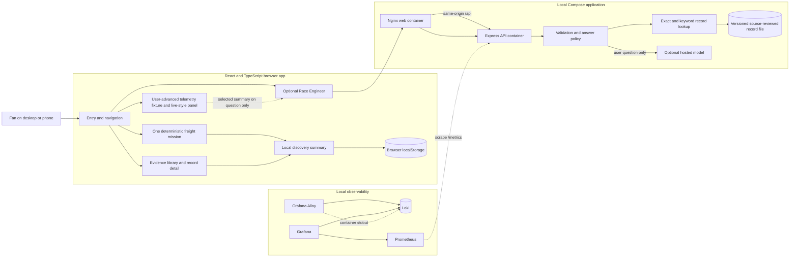
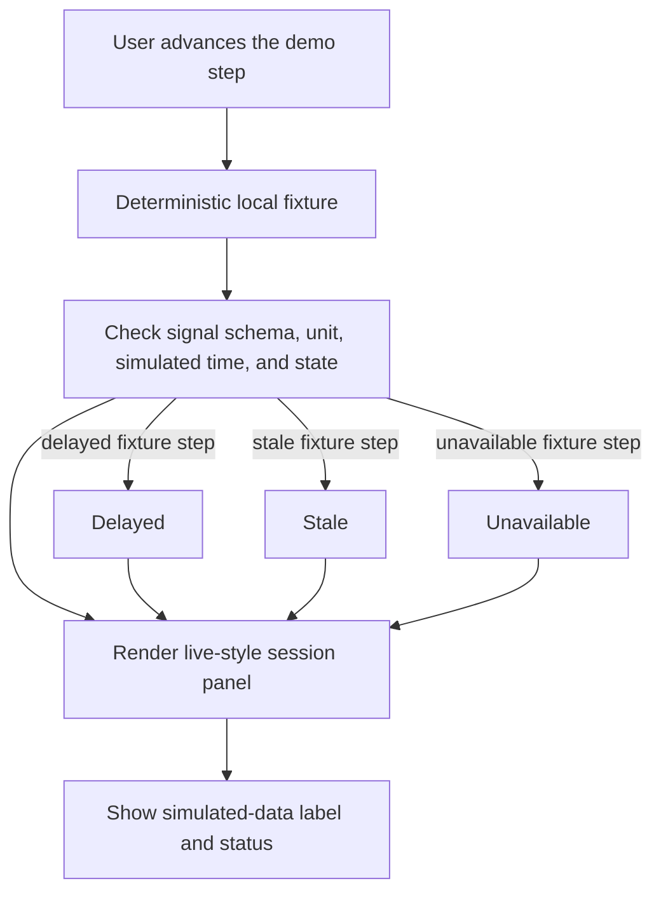
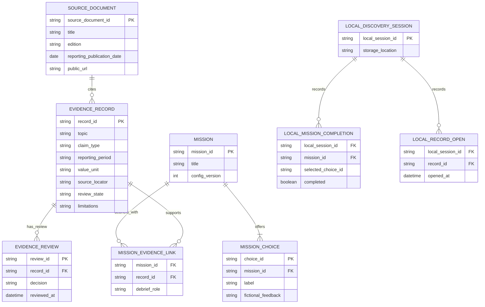
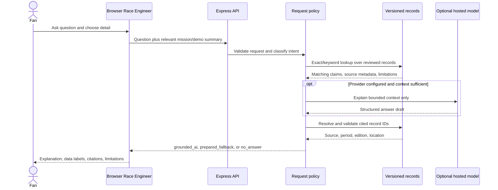
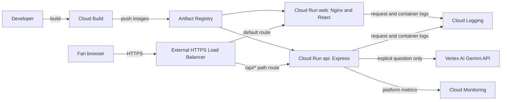

# Make A Mark Impact Drive Architecture

**Status:** Target architecture for hackathon R1. The current prototype does not yet include the R1 telemetry panel, source-reviewed evidence records, or live model integration. It currently uses a prepared Race Engineer response and illustrative records.

## Purpose and scope

R1 is a fan-facing experience in which a user can explore one fictional freight mission, inspect a limited set of source-checked AMF1 ESG records, and optionally ask a Race Engineer to explain the selected evidence and a simulated session state. The prototype uses a deterministic, manually advanced telemetry fixture. It does not connect to AMF1 systems and makes no claim that demo values are real or measured impacts.

The [inclusive R1 concept](Make-a-Mark-R1-inclusive-AI-concept.md) remains the product requirements source for audience, desirability, business opportunity, AMF1 placement, and evaluation framing. This document defines the software and data boundaries.

In scope: the React/Vite browser experience, small Express API, file-backed source-reviewed record subset, provider-neutral model adapter, deterministic demo fixture, local Compose stack, and local observability. Out of scope: accounts, user profiles, external telemetry access, continuous AI narration, vector search, database-backed content management, automated source approval, post-R1 production work, and claims that gameplay changes real-world impact.

## Architecture principles

1. Keep mission choices and results deterministic and fictional.
2. Keep four information categories separate: **Simulated live view**, **Reported impact**, **Illustrative impact placeholder**, and **Mission scenario**.
3. Use the telemetry fixture to demonstrate the interface and feed states; it never calculates impact.
4. Ground factual explanations in source-checked records and resolve citations from the record file.
5. Call a hosted model only after a user submits a question. Never send every fixture update to AI.
6. Leave browsing and the mission usable without model credentials or network access.
7. Support direct entry to the mission or evidence library without sign-in or age-based profiling.
8. Keep the R1 evidence subset small and versioned. Avoid infrastructure that the prototype does not need.

## System architecture

The telemetry fixture and its values run in the browser. The browser sends a bounded summary of the selected fixture step only when the user asks a related question. Nginx serves the built interface and proxies `/api` requests to Express. The API owns validation, record lookup, optional model calls, citation checks, and fallback selection. The hosted model is external to Compose and has no direct browser access.

## User experience and frontend boundaries

| Surface | R1 responsibility | Data boundary |
|---|---|---|
| Entry and navigation | Let users open the freight mission or evidence library directly; explain the product in plain language | No account or profile |
| Freight mission | Offer one route decision with deterministic fictional feedback, completion, and retry | Mission configuration and progress stay local; the result is not an impact measure |
| Live-style session view | Show a manually advanced scripted telemetry fixture, signal definition, unit, simulated time, and feed state | Fixture values are local demo data and do not represent an AMF1 feed |
| Evidence library | Browse the available Environment, Belong, and Community subset and inspect source details | Public source records are versioned; the library must not imply complete corpus coverage |
| Race Engineer | Offer a concise answer first or user-selected detail; show report citations, demo labels, and limitations | Calls `/api/engineer` only after an explicit question |
| Discovery summary | Show local mission completion and records opened | `localStorage`; not learning measurement or real-world impact |
| Trust and method | Explain source status, simulated values, periods, and limits | Static product copy |

Use semantic DOM controls, visible focus, keyboard and touch input, reduced motion, and an untimed non-driving path. Age is not an input to interface selection. Users can skip the game and open evidence directly.

## Information categories and trust rules

| Category | Meaning | Required treatment |
|---|---|---|
| **Simulated live view** | Scripted fixture values that advance only when the user advances the demo | Show signal, unit, simulated timestamp, and updating/delayed/stale/unavailable state. Label the view as simulated. |
| **Reported impact** | A claim in a published AMF1 ESG source | Show claim wording, source document/link, edition or date, reporting period, source location when available, and limitations. Do not imply AMF1 endorsement of this prototype. |
| **Illustrative impact placeholder** | Fictional sample value demonstrating a possible future metric display | Show the exact label: “Illustrative demo data — not live AMF1 data or a measured impact result.” Keep it adjacent to every placeholder. |
| **Mission scenario** | Fictional freight choice and deterministic game outcome | Label as fictional scenario. Never derive score or outcome from telemetry or evidence. |

A record can be source-checked for the prototype without being described as formally approved by AMF1. Only records that pass the project’s documented source review enter factual lookup. Unreviewed or rejected records are excluded. Source dates and reporting periods remain distinct.

## Telemetry fixture and state flow

The demo is user-advanced, not timer-driven. The fixture contains a finite, deterministic sequence and explicit updating, delayed, stale, and unavailable examples so a presenter can reproduce each state. Timestamps advance in demo time and are explicitly labeled simulated. No feed connection, credentials, polling, or background AI work is part of R1. A malformed or absent fixture value produces an unavailable state rather than an inferred value.

## Evidence records and retrieval

The small R1 record set is manually curated from public AMF1 sources and stored as versioned structured files. It contains only the available records that have passed source review. The record shape includes a stable ID, pillar/topic, claim type, exact claim or summary, value and unit when applicable, reporting period, source title and edition/date, URL and location, review state, and limitations. Keep source documents and records separate from illustrative placeholders.

R1 uses deterministic exact and keyword matching over this small set, optionally with topic, period, source, and claim-type filters. It does not use chunk embeddings, vector search, a graph database, OCR automation, or an always-running ingestion service. If matching records do not support the question, return a limitation or no-answer response instead of relying on general model knowledge.

The diagram is a logical model, not a requirement to deploy a database. `LOCAL_*` discovery events remain in browser storage. Demo snapshots are ephemeral request context and are not stored as evidence or persistent telemetry.

## Race Engineer request and retrieval flow

1. The user submits a question and chooses concise or detailed explanation. The UI may include the current fictional mission choice and the selected demo-state summary when relevant.
2. Express validates request shape and question length, then separates mission-rule questions from evidence questions.
3. For evidence questions, the API searches only source-reviewed records and builds a bounded context package. For telemetry questions, it uses only the supplied demo summary and signal definition.
4. If a hosted provider is configured, the server requests a constrained explanation from the selected context. The model cannot modify fixture values, mission rules, source records, or review state.
5. The API validates the response, accepts only IDs in the retrieved context, and resolves citation metadata from the record file.
6. If no provider is configured, it is unavailable, or evidence is insufficient, return the prepared fallback or `no_answer` mode with an explicit limitation.

### API boundary

| Endpoint | Current behavior | R1 target |
|---|---|---|
| `GET /api/health` | Reports prototype and illustrative-evidence mode | Report API availability and whether the optional provider is configured; do not expose secrets |
| `POST /api/engineer` | Validates a 1–500 character question and returns prepared fallback | Accept the question, concise/detailed choice, optional mission context, and a bounded demo snapshot when relevant; return answer mode, explanation, limitations, and API-resolved citations |

R1 response modes are `grounded_ai`, `prepared_fallback`, and `no_answer`. Use concise as the default. Every factual citation is resolved from a matching source-reviewed record, never generated freely by the model. The API does not persist request text, prompts, demo snapshots, or player history.

## Deployment, privacy, and resilience

### Local prototype profile

The local Compose baseline contains `web` (Nginx and the React build), `api` (Express), `prometheus`, `loki`, `alloy`, and `grafana`. Grafana queries Prometheus and Loki; Alloy forwards container stdout to Loki. Keep only the web app port reachable to the user. Bind Grafana to loopback and keep API, Loki, Prometheus, and Alloy interfaces private. This profile is the default build target and requires no cloud project. Do not add Postgres, pgvector, Redis, an ingestion container, or a model-serving container for R1.

### Optional Google Cloud demo-hosting profile

When the team needs a shareable hosted demo, use one Google Cloud project with billing enabled. In the Console, enable Cloud Build, Artifact Registry, Cloud Run, and Compute Engine/Load Balancing APIs; enable Vertex AI only if that model provider is selected, and Secret Manager only if an external static API key is used. The Google Cloud Console is the administrative interface; it is not a runtime service. The `gcloud` CLI or Cloud Build starts deployment work.

Build the same `web` and `api` containers with Cloud Build and publish them to Artifact Registry. Run Nginx/React as one Cloud Run service and Express as a second. Put an external HTTPS Application Load Balancer in front, with serverless network endpoint groups and a URL map routing `/api/*` to the API and other paths to the web service. This preserves same-origin browser requests. Configure Cloud Run ingress as `internal-and-cloud-load-balancing`; allow anonymous prototype traffic through the load balancer while blocking direct default service URLs. The HTTPS load-balancer profile requires a controlled domain and TLS certificate; use Cloud DNS for records only if DNS is not managed elsewhere.

The provider-neutral adapter can use Vertex AI Gemini API as the first hosted model option. Enable the Vertex AI API and grant the API service identity the least permissions it needs, such as Vertex AI User. Use the Google Cloud service identity rather than a downloaded service-account key. Secret Manager is needed only when choosing an external provider that requires a static API key. The API calls the provider only after an explicit user question.

Cloud Run request/container logs go to Cloud Logging. Use Cloud Monitoring for platform metrics and alerts and Error Reporting for application exceptions. Keep the local Grafana/Loki/Prometheus/Alloy stack for Compose development; it is not a required Cloud Run deployment. Cloud Armor rate limiting is an optional public-demo safeguard. No database, vector index, Redis, ingestion job, or model container is introduced by this hosting profile.

The optional model provider is called only by Express. Do not log raw questions, model prompts, source passages, credentials, or demo signal values. Logs may record route, status, duration, response mode, and dependency error class with low-cardinality labels. Avoid user-controlled text and request IDs as metric labels.

If the API or model is unavailable, the game, fixture walkthrough, and evidence library remain usable. Clear local discovery state in the browser separately from Docker volumes. Resetting Compose storage must never remove versioned source records. Cloud resources and logs are reset or retained through their own project policies; no player account or database is added.

## Implementation status

The existing prototype includes React/Vite, an Express API, a deterministic fictional mission, illustrative TypeScript records, browser-local discovery, reduced-motion support, and a prepared Race Engineer fallback. It does not include the R1 telemetry fixture, selected source-checked AMF1 records, the R1 retrieval policy, live model calls, Docker Compose, or Grafana services. Those are planned, not implemented.

## Related plans

- [Eight-step build order and detailed guides](build-plan/index.md)

- [Component and container plan](component-and-container-plan.md)
- [R1 development plan](r1-development-plan.md)
- [ADR-0002 R1 architecture](adr/0002-inclusive-r1-architecture.md)
- [Inclusive R1 concept](Make-a-Mark-R1-inclusive-AI-concept.md)

### Google Cloud service references

- [Cloud Run with an external Application Load Balancer](https://docs.cloud.google.com/load-balancing/docs/https/setting-up-reg-ext-https-serverless)
- [Cloud Run ingress settings](https://docs.cloud.google.com/run/docs/securing/ingress)
- [Cloud Build container images in Artifact Registry](https://docs.cloud.google.com/build/docs/building/build-containers)
- [Configure Cloud Run secrets](https://docs.cloud.google.com/run/docs/configuring/services/secrets)
- [Gemini API in Vertex AI quickstart](https://docs.cloud.google.com/vertex-ai/generative-ai/docs/start/quickstart)
- [Cloud Run logging and monitoring](https://docs.cloud.google.com/run/docs/monitoring-overview)
