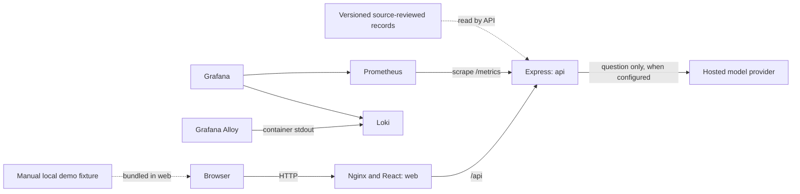

# Make A Mark Impact Drive Component and Container Plan

**Status:** Target local deployment for hackathon R1. The application components below describe the plan; Docker Compose and the observability stack are not currently configured.

## Recommendation

Keep the product in one React web container and one Express API container. Run the telemetry fixture in the browser as a deterministic, user-advanced file-backed sequence. Keep a small source-reviewed evidence set in versioned files. Add local observability containers for the API and app without adding a database, vector service, ingestion job, Redis, or model container.

The hosted model is an optional outbound API used by Express after a user submits a question. If provider credentials are absent or the provider is unavailable, the Race Engineer uses a prepared fallback or no-answer response. No model key or direct provider request belongs in the browser.

## Component catalogue

### Browser application

| Component | Responsibility and boundary | Technology | Placement |
|---|---|---|---|
| App shell and navigation | Direct entry to the freight mission or evidence library; consistent plain-language navigation | React, TypeScript, Vite | One `web` build served by Nginx |
| Freight mission | One deterministic fictional route scenario, feedback, retry, and completion | React and versioned mission configuration | Browser in `web`; no API/database dependency |
| Demo session panel | Display signal, unit, simulated timestamp, and updating/delayed/stale/unavailable examples | React plus a finite local fixture and manual step control | Browser in `web`; no telemetry network connection |
| Evidence library/detail | Browse limited Environment, Belong, Community evidence and source details | React and a small public source-reviewed record set | Browser in `web`; source-reviewed public metadata may be bundled or fetched from same-origin API |
| Race Engineer panel | Ask a question; select concise or detailed explanation; view answer mode, source, demo labels, citations, and limitations | React; same-origin `/api/engineer` | Browser in `web`; provider is never called directly |
| Discovery summary | Show local mission completion and records opened | React and `localStorage` | Browser only; no player account or API write |
| Trust/method content | Explain fictional rules, source status, simulated states, and limitations | Static product content | Browser in `web` |

All interface features must remain keyboard and touch operable. Respect reduced-motion settings and provide an untimed non-driving path. Do not select explanation depth based on age or build a profile.

### API application

| Component | Responsibility | Technology | Placement |
|---|---|---|---|
| HTTP boundary | `GET /api/health`, `POST /api/engineer`; request size and question limits | Node.js, Express, TypeScript | One `api` container |
| Request validator | Validate question and optional depth/mission/demo context before provider or retrieval work | Express middleware and shared types | `api` process |
| Answer policy | Keep fictional mission rules distinct from reported facts and simulated demo state | TypeScript service | `api` process |
| Evidence lookup | Exact and keyword search over source-reviewed records; exclude unreviewed content | Deterministic TypeScript over versioned records | `api` process |
| Demo context validator | Validate fixture state shape, signal definitions/units, and simulated timestamp; accept only bounded current summary | TypeScript schema validation | `api` process; demo values are ephemeral request context |
| Provider adapter | Ask a hosted provider for an explanation of the bounded context only | Provider-neutral adapter over outbound HTTPS | `api` process; external provider, optional |
| Citation mapper and response validator | Verify cited record IDs were retrieved and resolve source metadata from records | TypeScript service | `api` process |
| Logging and metrics | Structured, privacy-safe operational logs and low-cardinality metrics | JSON logger and Prometheus client | `api` stdout and `/metrics` |

### Source content and demo data

| Asset | Purpose | Lifecycle and trust boundary |
|---|---|---|
| Mission configuration | Fixed route options and fictional feedback | Versioned with the app; never influenced by AI or telemetry values |
| Scripted telemetry fixture | Deterministic manually advanced live-style demo and reproducible feed states | Versioned local data; all values and timestamps visibly simulated |
| Source-reviewed evidence records | Public AMF1 report claims, period, location, review notes, and limitations | Small hand-curated file set; source checked before factual retrieval; not labeled AMF1-approved without authorization |
| Placeholder examples | Illustrate a possible future live impact card | Demo-only UI copy; display “Illustrative demo data — not live AMF1 data or a measured impact result.” adjacent to each value |
| Derived search helper | Token/keyword normalization for the small record set | Rebuilt or loaded by the API; no persisted vector index |

Do not implement automatic PDF extraction or unattended approval in this release. Source files and claims need editorial checking before they can support an answer.

## Services needed to run R1

### Local prototype services

| Service or tool | Function | Required for |
|---|---|---|
| Node.js and npm | Install packages, run Vite and Express during development, and build the web assets | Local development |
| Docker Desktop with Docker Compose | Build and start the isolated local services and reset their volumes | Reproducible local demo stack |
| Nginx | Serve the built React app and proxy same-origin `/api` requests to Express | `web` container |
| Express API | Validate questions, retrieve reviewed records, resolve citations, and call the model adapter only on submission | `api` container |
| Prometheus, Loki, Grafana Alloy, Grafana | Collect API metrics and container logs, explore them, and review service health | Local observability profile |
| Hosted LLM API | Generate a bounded explanation after explicit user submission | Optional; prepared fallback and no-answer work without it |

The mission, telemetry fixture, records, and exact/keyword retrieval are file-backed and need no database, cache, or separate ingestion service. The hosted model requires outbound HTTPS and server-side configuration only. Local `.env` values are ignored by version control.

### Optional Google Cloud hosting services

Google Cloud Console is the control panel used to create and inspect resources; it does not run the app. A hosted demo also requires a Google Cloud project, billing, enabled product APIs, and a least-privilege service identity.

| Google Cloud service | Function | Required or conditional use |
|---|---|---|
| Cloud Run `web` | Runs Nginx and serves the React/Vite production build | Required for this Cloud Run hosting profile |
| Cloud Run `api` | Runs Express, retrieval, citation checks, and model adapter | Required for this Cloud Run hosting profile |
| External HTTPS Application Load Balancer, URL map, serverless NEGs | Terminates HTTPS and routes `/api/*` to the API and other paths to web on one origin | Required for the recommended same-origin cloud route |
| Cloud Build | Builds the two images from the repository or a submitted source bundle | Recommended deployment builder; local Docker builds can substitute |
| Artifact Registry | Stores versioned container images for Cloud Run | Required when deploying images from a private registry |
| IAM service identity | Gives the API only the permissions needed for its configured provider and secrets | Required for the API runtime |
| Vertex AI API (Gemini) | Example hosted model endpoint, called only by Express | Optional model provider; enable only if selected |
| Secret Manager | Supplies a static third-party model API key to the API | Conditional; Vertex AI can use the Cloud Run service identity instead |
| Cloud Logging and Cloud Monitoring | Collect Cloud Run logs and platform metrics; configure dashboards and alerts | Provided cloud observability path |
| Error Reporting | Groups application exceptions for investigation | Recommended for hosted demo diagnosis |
| Custom domain, HTTPS certificate, and DNS | Domain-based TLS for the external load balancer; Cloud DNS hosts DNS records if selected | Required for the recommended HTTPS load-balancer profile; Cloud DNS is optional if DNS is managed elsewhere |
| Cloud Armor | Adds edge security and rate limiting for a public demo | Optional safeguard; set budget and limits before opening the demo broadly |

Keep Grafana, Loki, Prometheus, and Alloy in the local Compose profile. Cloud Run's built-in Cloud Logging and Cloud Monitoring are the cloud-hosted observability path. Do not deploy both stacks in the cloud by default. Configure the public load balancer to forward to services with Cloud Run ingress restricted to the load balancer; verify that direct service URLs are blocked while anonymous users can reach the demo through the shared HTTPS domain. The recommended load-balancer route needs a controlled domain and TLS certificate; Cloud DNS is optional when DNS is hosted elsewhere.

## Docker Compose services

| Service | Container contents | Connections | Exposure and persistence |
|---|---|---|---|
| `web` | Production React assets and Nginx | Proxies `/api` to `api` | The only app port published; no durable user volume |
| `api` | Express, request policy, lookup, optional provider adapter, health and metrics | Outbound HTTPS to provider only when configured | Internal Compose network; structured logs to stdout |
| `prometheus` | Scrapes API metrics | Reads `api:/metrics` | Internal or loopback-only UI; bounded local history volume |
| `loki` | Stores/query local container logs | Receives logs from Alloy | Internal only; bounded local log volume |
| `alloy` | Collects container stdout and forwards to Loki | Docker Engine log source and Loki | No public UI; local Docker socket access is a reviewed local privilege |
| `grafana` | Dashboards, log/metric exploration, local alerts | Queries Loki and Prometheus | Bind UI to `127.0.0.1`; optional Grafana state volume |

There is no `postgres`, `pgvector`, `redis`, `ingest`, user-session, or model-serving container in the R1 Compose design. Grafana is the dashboard and alert surface; Loki stores logs, Alloy collects them, and Prometheus stores metrics. Grafana is not an issue-ticket system.

## Ports, configuration, and reset behavior

- Publish only the web app by default. Bind Grafana to loopback; keep API, Loki, Prometheus, and Alloy internal.
- Pin container image versions. Use the production Nginx image for a demo; keep Vite hot reload in a separate development override if needed.
- Keep provider credentials in an ignored local `.env` or approved secret mechanism. Commit blank placeholders only. Pass secrets only to `api`.
- Include health checks for web/API and observability services. Model-provider readiness is optional and must not mark the core app unavailable.
- `docker compose down` stops containers and preserves observability volumes.
- The full local reset removes local Grafana, Loki, and Prometheus state. It does not modify source-reviewed files, browser `localStorage`, or the packaged demo fixture.
- Clear browser `localStorage` separately to reset player discoveries. Advancing the fixture to its first step resets the live-style walkthrough.

## Observability signals

Log request timestamp, route, status class, response mode, duration, and dependency error category. Do not log the raw question, provider prompt, evidence text, demo signal values, or secret. Use service, environment, and severity as Loki labels; avoid high-cardinality user inputs.

Expose API metrics for request count/latency, validation failures, grounded/fallback/no-answer response counts, and provider availability/error class. Never label metrics by question, record ID, session, or request ID. Starter Grafana panels should answer: Is the API up? Are requests failing or slowing? How often is fallback/no-answer used? Is the local log or metrics store near its configured retention limit?

## Build order and component functions

Use the [eight detailed build guides](build-plan/index.md) for actionable sub-steps, dependencies, deliverables, and completion criteria.

| Order | Build and function | Services/tools needed to run it |
|---|---|---|
| 1. Define contracts | Separate mission rules, fixture snapshots, report claims, illustrative placeholders, request/response types, and source-review fields | Node.js/npm and versioned files; no cloud services |
| 2. Build the experience | Add React entry routes, deterministic mission, accessible library, and user-controlled explanation depth | React/Vite development server; browser; no account or backend dependency for mission flow |
| 3. Add demo data and retrieval | Add finite manually advanced updating/delayed/stale/unavailable states; add exact/keyword lookup over source-reviewed records | Browser fixture; Express API for retrieval; versioned files; no database or ingestion service |
| 4. Add Race Engineer | Validate explicit user questions, retrieve bounded context, call provider adapter, resolve citations, and choose AI/fallback/no-answer response | Express API; optional Vertex AI Gemini API or another hosted LLM; local `.env` or Cloud Run identity/Secret Manager; outbound HTTPS |
| 5. Package local services | Build production web assets; serve with Nginx; connect same-origin `/api`; add health checks and resettable local observability | Docker Desktop/Compose; `web` Nginx, `api` Express, Prometheus, Loki, Alloy, Grafana |
| 6. Configure hosted demo (optional) | Create project, enable billing/APIs, build and push images, deploy services, and route the shared HTTPS origin | Google Cloud Console or `gcloud`; Cloud Build; Artifact Registry; Cloud Run; external HTTPS load balancer, URL map, and serverless NEGs; IAM |
| 7. Add cloud secrets and monitoring (optional) | Grant least privilege, connect hosted model safely, inspect logs/errors, and configure service alerts | Vertex AI API and API service identity; Secret Manager only for static third-party keys; Cloud Logging, Monitoring, Error Reporting; optional Cloud Armor |
| 8. Rehearse and reset | Verify states, no-provider fallback, source traceability, privacy-safe logs, accessibility, and reset instructions | Local Compose profile or deployed cloud profile; browser; Grafana locally or Cloud Console observability in cloud |

The local profile is the default implementation target. The GCP profile is for a shareable hosted demo and does not change the no-account, no-AMF1-feed, file-backed R1 product scope. See the [R1 development plan](r1-development-plan.md) for acceptance checks. No Compose or cloud deployment files currently exist in the workspace.
